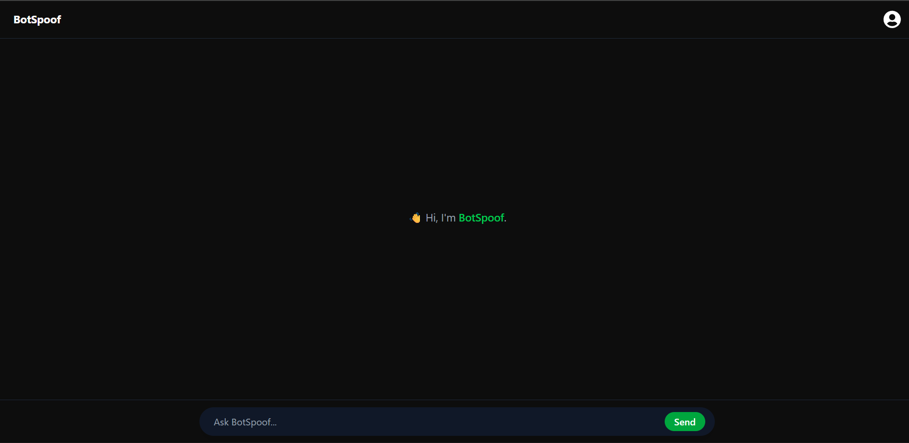
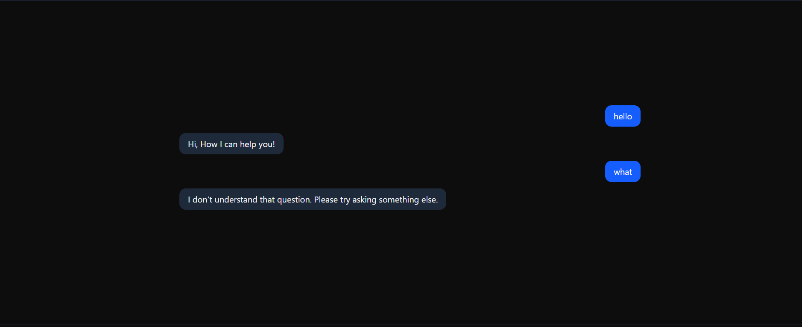

# BotSpoof - Interactive Chat Bot

A full-stack chatbot application built with React, Node.js, and MongoDB. The bot provides answers to questions using a predefined knowledge base.

## 🚀 Features

- Real-time chat interface
- Pre-trained responses for various topics
- Automatic message scrolling
- Loading states and typing indicators
- User-friendly error handling
- Responsive design
- Message persistence using MongoDB

## 🛠️ Tech Stack

### Frontend
- React.js
- Tailwind CSS
- Axios for API calls
- React Icons
- Modern UI with dark theme

### Backend
- Node.js
- Express.js
- MongoDB with Mongoose
- CORS enabled
- JSON-based knowledge base

## 📁 Project Structure

```
Chat_Bot/
├── frontend/                # React frontend application
│   ├── src/
│   │   ├── components/     # React components
│   │   │   └── bot.jsx     # Main chat interface
│   │   ├── App.jsx         # Root component
│   │   └── main.jsx        # Entry point
│   └── public/             # Static files
├── backend/                # Node.js backend
│   ├── controller/        # Request handlers
│   │   ├── bot.controller.js
│   │   └── user.controller.js
│   ├── model/            # Database models
│   │   ├── bot.model.js
│   │   └── user.model.js
│   ├── routes/           # API routes
│   │   └── bot.routes.js
│   ├── questions.json    # Bot's knowledge base
│   └── index.js          # Server entry point
```

## 🚀 Getting Started

### Prerequisites
- Node.js (v14 or higher)
- MongoDB
- npm or yarn

### Installation

1. Clone the repository:
```bash
git clone https://github.com/Ankush321-collab/Chat_Bot.git
cd Chat_Bot
```

2. Install backend dependencies:
```bash
cd backend
npm install
```

3. Install frontend dependencies:
```bash
cd ../frontend
npm install
```

4. Set up environment variables:
Create a .env file in the backend directory:
```env
MONGODB_URI=your_mongodb_connection_string
PORT=5000
```

### Running the Application

1. Start the backend server:
```bash
cd backend
npm run dev
```

2. Start the frontend development server:
```bash
cd frontend
npm run dev
```

The application will be available at `http://localhost:5173`

## 💬 API Endpoints

### POST /api/message
Send a message to the bot

Request body:
```json
{
    "text": "what is gravity"
}
```

Response:
```json
{
    "success": true,
    "user": {
        "text": "what is gravity",
        "timestamp": "2025-09-03T..."
    },
    "bot": {
        "text": "Gravity is the force that pulls objects toward the center of the Earth.",
        "timestamp": "2025-09-03T..."
    }
}
```

## 📝 Database Schema

### User Message Schema
```javascript
{
    sender: {
        type: String,
        required: true,
        enum: ["user"]
    },
    text: {
        type: String,
        required: true
    },
    timestamp: {
        type: Date,
        default: Date.now
    }
}
```

### Bot Message Schema
```javascript
{
    text: {
        type: String,
        required: true
    },
    timestamp: {
        type: Date,
        default: Date.now
    }
}
```

## 🎨 Features in Detail

### Frontend
- Modern, responsive UI with dark theme
- Real-time chat interface
- Automatic scrolling to latest messages
- Loading states and typing indicators
- Error handling with user feedback
- Send messages via button click or Enter key
- Distinct styling for user and bot messages

### Backend
- RESTful API architecture
- MongoDB for message persistence
- Separate models for user and bot messages
- JSON-based knowledge base for bot responses
- Error handling and validation
- CORS enabled for frontend access

## 🤖 Bot Knowledge Base
The bot's responses are stored in `questions.json`. The file contains key-value pairs where:
- Keys are questions (case-insensitive)
- Values are the corresponding answers

Example:
```json
{
    "what is gravity": "Gravity is the force that pulls objects toward the center of the Earth.",
    "what is photosynthesis": "The process by which plants make food using sunlight, carbon dioxide, and water."
}
```



## 🔍 Future Improvements
- Add user authentication
- Implement more sophisticated message matching
- Add support for multiple languages
- Include message history feature
- Add typing indicators
- Implement real-time notifications

## 📜 License
This project is licensed under the MIT License.

## 👥 Contributing
Contributions are welcome! Please feel free to submit a Pull Request.
